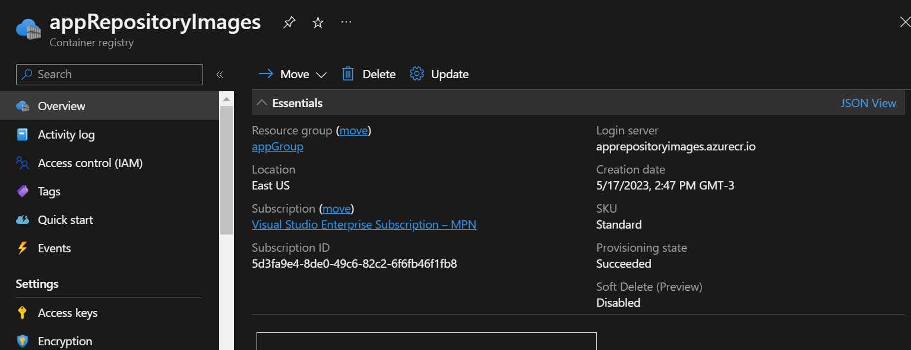
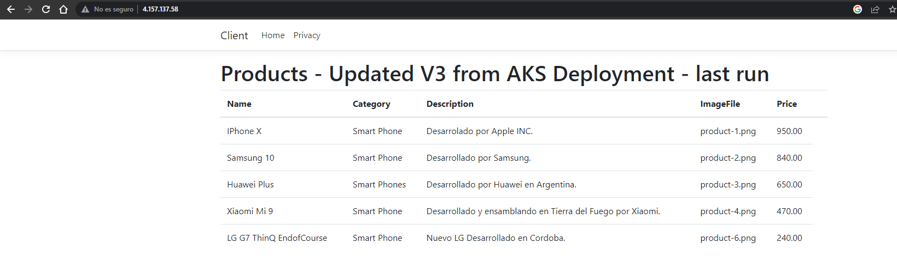

# GitHub Action CI/CD microservicios

## Introduccion:

Este proyecto tiene la finalidad de hacer un proceso CI/CD utilizando GitHub Action en un entorno cloud de Azure. Para ello se dispone en este repositorio el codigo fuente de una applicacion y un cliente .NET y una base de datos Mongo. Estos seran microservicios que utilizaremos para lograr el deployment en AKS utilizando un registro de imagenes ACR.  

### Arquitectura

El flujo de trabajo sera el siguiente: 


Siguiendo estrategias de [Gitflow][flow] dispondemos de una rama _develop_ en la que tiene que ser utilizada para trabajar el codigo fuente. Dejando la rama _main_ como rama productiva. 


[flow]: https://www.atlassian.com/es/git/tutorials/comparing-workflows/gitflow-workflow

### API 

Dentro del directorio ***/src*** se encuntra los proyectos que utilizaremos. 

Para nuestra API tendremos una aplicacion en .NET que se vincula con una base de datos Mongo. Esta api seteara informacion de productos a la base de datos. Como tambien dispone de un metodo GET en el controlador para recuperar este listado. 

Dentro de este directorio se encuntra el Dockerfile necesario para contruir nuestra imagen para el contenedor que desplegaremos luego. 


### Client

Dentro del directorio ***/src*** se encuntra los proyectos que utilizaremos. 
Comenzaremos desarrollando Asp.Net MVC para crear un cliente que se conecte a nuestra API y pueda consumir la informacion a travez del endpoint expuesto y obtener asi los datos ya mencionados. 

Dentro de este directorio se encuntra el Dockerfile necesario para contruir nuestra imagen para el contenedor que desplegaremos luego. 


### Running LOCAL

Imaginemos un escenario posible, somos parte del equipo de desarrolladores e hicimos nuestro cambios. Para poder levantar estos servicios de manera local en la raiz de repositorio disponemos de los file _docker-compose.yml_ y _docker-compose.override.yml_.  De esta manera haciendo los siguientes comandos haremos un build de cada servicios utilizando los Dockerfile que disponemos y como resultado tendremos nuestra imagen de la API y el Cliente. En el caso de MongoDB no es necesario disponer de un dockerfile ya que usara el repositorio de Oficial.

Para compilar y crear nuestra imagenes de contenedores necesarias ejecutamos el comando _build_. Y para levantar nuestros servicios hacemos el comando _up_:

```bash
 docker-compose  -f .\docker-compose.yml -f .\docker-compose.override.yml build
 docker-compose  -f .\docker-compose.yml -f .\docker-compose.override.yml up -d
```

Algunos detalles como variables de entorno se encuentran en el file _docker-compose.override.yml_ hay que tener en cuenta por ejemplo la conexion a la base de datos. El punto de conexion sera el nombre de nuestro contenedor ejecutando. Otros detalles son los mapeo de puertos desde el entorno local al port del contenedor, como tambien los volumenes creados. 


Una vez corriendo nuestro contenedores podemos hacer nuestras pruebas y cambios en un entorno local. 
Ejecutando el siguiente comandando veremos nuestros contendores ejecutando:
```bash
 docker ps -a
```


## CI 

A esta altura podemos crear un pipeline de integracion continua con GitHub Actions. Para ello volviendo a arquitectura propuesta necesitamos disponer de un ACR en Azure. Con este repositorio de imagenes disponible y privado para nosotros, el pipeline se encargara de hacer un Build de la API y del Client de su respectivo Dockerfile y con la imagen creada hacer un push al repositorio ACR.
No es necesario enviar la imagen de mongo ya que no usamos un dockerfile. La imagen de MongoDB se encuentra disponible de su DockerHub Oficial. 


En la seccion de Access Key de nuestro ACR habilataremos el acceso Admin y tendremos informacion como ***login server, username, password*** necesario para crear nuestro pipeline. 

En la seccion Configuracion->Secrets->Action de nuestro repositorio configuraremos _Repository Secrets_ 

Definimermos los siguientes secretos con el valor sacado de nuestro ACR en el portal: 

- ACR_PASSWORD
- ACR_USERNAME  

Dentro de la carpeta ***/.github/workflows***  tenemos disponible nuestro pipelie CI que se encargara de hacer de construir nuestra imagen y pushearla a nuestro repositorio en Azure.
En este caso, siguiendo la logica del pipeline y el flujo de trabajo que buscamos, se ejecutara cuando haya un push o pull request a la rama develop. Generando una image con un tag con el _github.sha_ de nuestro commit. Esto se hace de esta manera para tener una imagen creada en base a la version actual del commit en la rama de desarrollo.  Caso contrario sera cuando se haga un push o pull request a nuestra rama main productiva donde el pipeline sera otro que se vera mas adelante.


## CD

La idea es pensar en hacer un despliegue continuo cuando nuestra etapa de desarrollo ha concluido y queremos entregar una nueva version de nuestro software. 
Las tareas que realiza el pipeline las puede encontrar en el respectivo archivo para CD en el directorio ***/.github/workflows***. Se encargara de hacer un build y push de la imagen de nuestra api y cliente pero esta vez con el tag _latest_ ya que solo se ejecuta este pipeline cuando hay un push o pull request a la rama productiva main. 

Para poder ejecutar comandos de _kubectl_ en nuestro cluster, hay que hacer login en nuestra cuenta de Azure. Para ello previamente de configurar el pipeline desde la terminal local hay hacer el siguiente comando: 

```bash
 az login
```
De esta manera obtenedra un JSON con informacion de su cuenta como su _SuscripcionID_ o _id_. 
Con esta informacion podremos obtener el siguiente JSON que usaremos para poder vincularnos con nuestra cuenta de Azure desde el pipeline. 

```bash
  az ad sp create-for-rbac --name "GitHub-Action-myapp" --role contributor \
                                --scopes /subscriptions/{subscription-id}/resourceGroups/{resource-group} \
                                --sdk-auth
```

Debera copiar la salida del comando en una variable secreta: 
```bash
{
    "clientId": "<GUID>",
    "clientSecret": "<GUID>",
    "subscriptionId": "<GUID>",
    "tenantId": "<GUID>",
    (...)
}
```
Se debe crear una variable secreta al igual como si hizo con las credenciales de ACR. Esta variable se llama:

 - AZURE_CREDENTIALS

De esta manera va poder loguearse en el portal con su cuenta y poder usar la consola para ejecutar comandos de _kubectl_ y poder desplegar sos pods.

```bash
 kubectl create secret docker-registry acr-secret --docker-server=$AZURE_CONTAINER_REGISTRY --docker-username=${{ secrets.ACR_USERNAME }} --docker-password=${{ secrets.ACR_PASSWORD }} 
 ```
 Ejecute una unica vez para poder referenciar desde el cluster al contenedor de sus imagenes y pueda hacer pull cuando ejecute los deployment.
 
 
 Luego desde la consola de nuestro cluster ejecutamos los comandos necesarios para hacer pull de estas ultima version de las imagenes a usar para nuestros deployment.
 
 Los manifest usados se encuentran en la carpeta **/k8s/**. 


De esta  manera si vericamos los logs de nuestro pipeline veremos un comando luego de hacer el despliegue :

```bash
kubectl get service

NAME               TYPE           CLUSTER-IP     EXTERNAL-IP    PORT(S)        AGE
kubernetes         ClusterIP      10.0.0.1       <none>         443/TCP        12d
mongo-service      ClusterIP      10.0.176.240   <none>         27017/TCP      36m
myapi-service      ClusterIP      10.0.43.146    <none>         80/TCP         36m
myclient-service   LoadBalancer   10.0.25.171    4.157.137.58   80:32450/TCP   3m33s
```

Como se ve asociamos nuestro pod como un servicio del tipo LoadBalancer y nos brinda una IP publica, que si vamos a nuestro buscado podemos ver ya desplegado nuestra cliente 




## IP static

Se agrego una IP static al loadbalcer del cliente, por lo que se procedio primero a crear una IP como recurso en el portal de Azure dentro del grupo de recursos de nuestro cluster. 
De esta manera tambien se definio que esa ip es la que debe tomar cuando se levanta el servicio al hacer apply del deployment.