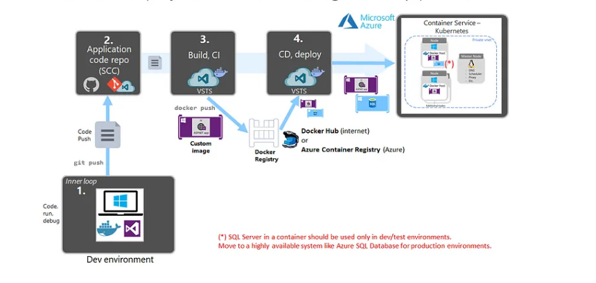
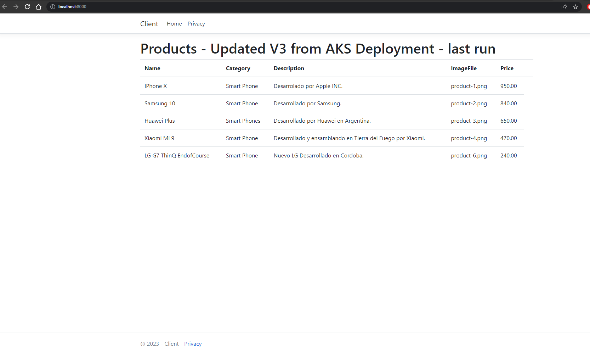
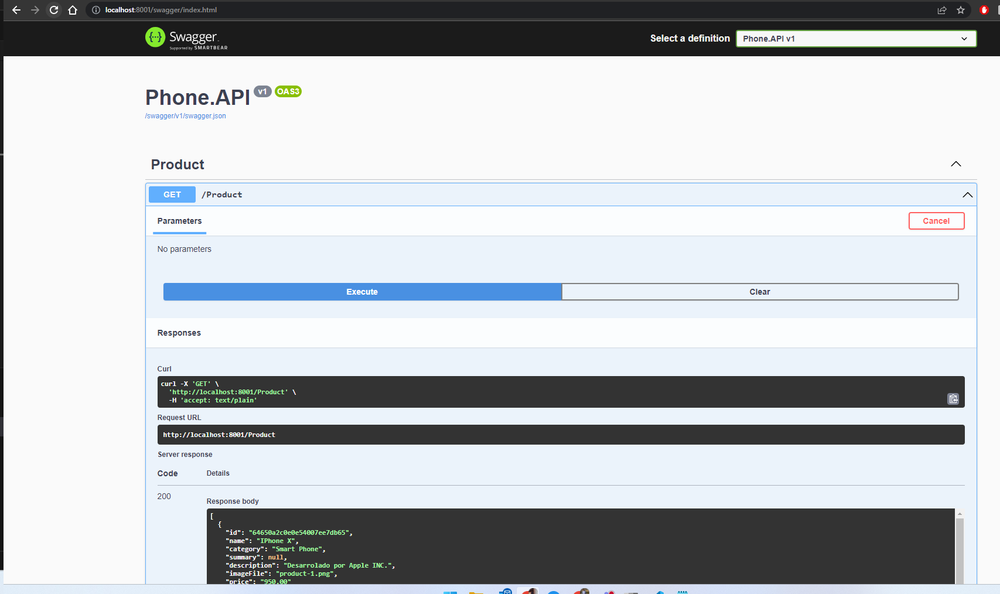

# GitHub Action CI/CD microservicios

## Introduccion:

Este proyecto tiene la finalidad de hacer un proceso CI/CD utilizando GitHub Action en un entorno cloud de Azure. Para ello se dispone en este repositorio el codigo fuente de una applicacion y un cliente .NET y una base de datos Mongo. Estos seran microservicios que utilizaremos para lograr el deployment en AKS utilizando un registro de imagenes ACR.  

### Arquitectura

El flujo de trabajo sera el siguiente: 



Siguiendo estrategias de [Gitflow][flow] dispondemos de una rama _develop_ en la que tiene que ser utilizada para trabajar el codigo fuente. Dejando la rama _main_ como rama productiva. 


[flow]: https://www.atlassian.com/es/git/tutorials/comparing-workflows/gitflow-workflow

### API 

Dentro del directorio ***/src*** se encuntra los proyectos que utilizaremos. 

Para nuestra API tendremos una aplicacion en .NET que se vincula con una base de datos Mongo. Esta api seteara informacion de productos a la base de datos. Como tambien dispone de un metodo GET en el controlador para recuperar este listado. 

Dentro de este directorio se encuntra el Dockerfile necesario para contruir nuestra imagen para el contenedor que desplegaremos luego. 


### Client

Dentro del directorio ***/src*** se encuntra los proyectos que utilizaremos. 
Comenzaremos desarrollando Asp.Net MVC para crear un cliente que se conecte a nuestra API y pueda consumir la informacion a travez del endpoint expuesto y obtener asi los datos ya mencionados. 

Dentro de este directorio se encuntra el Dockerfile necesario para contruir nuestra imagen para el contenedor que desplegaremos luego. 


### Running LOCAL

Imaginemos un escenario posible, somos parte del equipo de desarrolladores e hicimos nuestro cambios. Para poder levantar estos servicios de manera local en la raiz de repositorio disponemos de los file _docker-compose.yml_ y _docker-compose.override.yml_.  De esta manera haciendo los siguientes comandos haremos un build de cada servicios utilizando los Dockerfile que disponemos y como resultado tendremos nuestra imagen de la API y el Cliente. En el caso de MongoDB no es necesario disponer de un dockerfile ya que usara el repositorio de Oficial.

Para compilar y crear nuestra imagenes de contenedores necesarias ejecutamos el comando _build_. Y para levantar nuestros servicios hacemos el comando _up_:

```bash
 docker-compose  -f .\docker-compose.yml -f .\docker-compose.override.yml build
 docker-compose  -f .\docker-compose.yml -f .\docker-compose.override.yml up -d
```

Algunos detalles como variables de entorno se encuntran en el file _docker-compose.override.yml_ hay que tener en cuenta por ejemplo la conexion a la base de datos. El punto de conexion sera el nombre de nuestro contenedor ejecutando. Otros detalles son los mapeo de puertos desde el entorno local al port del contenedor, como tambien los volumnes creado. 


Una vez corriendo nuestro contenedores podemos hacer nuestras pruebas y cambios en un entorno local. 
Ejecutando el siguiente comandando veremos nuestros contendores ejecutando:
```bash
 docker ps -a
```

